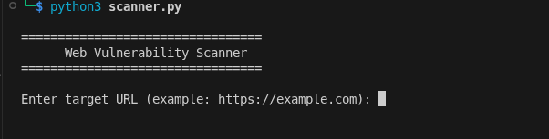
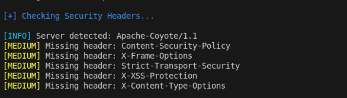
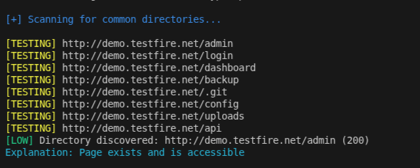
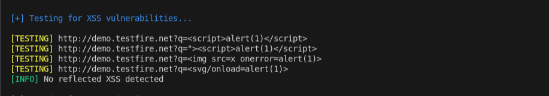
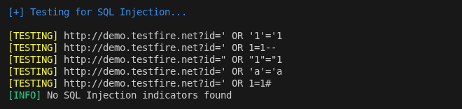
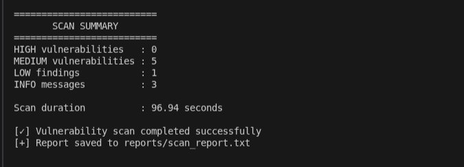
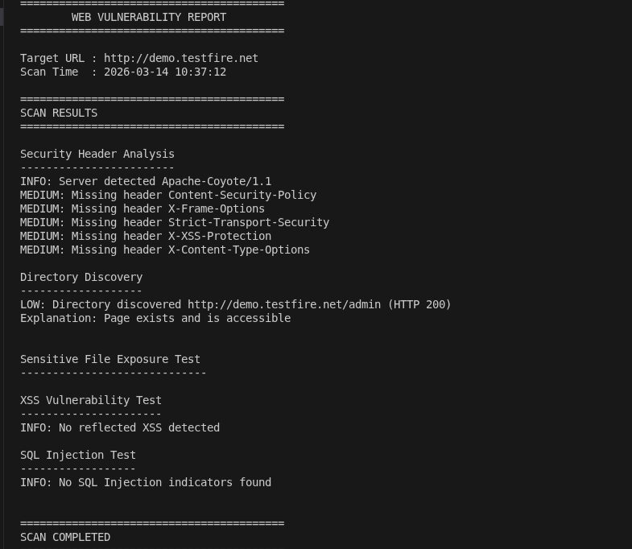

# Web Vulnerability Scanner

## Overview

This project is a Python-based web vulnerability scanner designed to identify common web security issues.

The scanner automates the process of analyzing a website and detecting potential vulnerabilities such as:

- Missing security headers
- Exposed directories
- Sensitive files
- Cross-Site Scripting (XSS)
- SQL Injection indicators

The tool performs automated testing and generates a vulnerability report after each scan.

---

## Features

- Security Header Analysis
- Directory Discovery
- Sensitive File Exposure Detection
- Cross-Site Scripting (XSS) Detection
- SQL Injection Detection
- Vulnerability Severity Classification (HIGH / MEDIUM / LOW / INFO)
- Automatic Scan Report Generation
- Scan Summary Output

---

## Technologies Used

- Python
- Requests Library
- Kali Linux
- VirtualBox (Testing Environment)

---

## Project Structure
web_vulnerability_scanner
│
├── modules
│ ├── bruteforce_detector.py
│ ├── colors.py
│ ├── directory_scan.py
│ ├── header_check.py
│ ├── sensitive_files.py
│ ├── sql_injection_detector.py
│ └── xss_detector.py
│
├── reports
│ └── scan_report.txt
│
├── screenshots
│ ├── scanner_start.png
│ ├── headers.png
│ ├── directory_discovery.png
│ ├── xss_testing.png
│ ├── sql_testing.png
│ ├── scanner_summary.png
│ └── scan_report.png
│
├── scanner.py
├── requirements.txt
└── README.md

---

# How the Scanner Works

1. The user enters a target URL
2. The scanner sends HTTP requests to the website
3. Multiple vulnerability checks are performed:

- Security header analysis
- Directory discovery
- Sensitive file detection
- XSS payload testing
- SQL injection payload testing

4. Results are displayed in the terminal
5. A detailed report is generated automatically

---

# Example Usage

Run the scanner:

Enter the target URL when prompted:

The scanner will analyze the website and display vulnerability results.

---

# Example Scan Output

Below is an example scan performed using the scanner against a test website.

---

## Scanner Running

---

## Header Vulnerability Detection

---

## Directory Discovery

---

## XSS Detection

---

## SQL Injection Detection

---

## Scan Summary

---

## Scan Report

---

# Example Vulnerabilities Detected

The scanner can identify issues such as:

- Missing security headers
- Exposed directories
- Sensitive files accessible to the public
- Possible Cross-Site Scripting vulnerabilities
- SQL injection indicators

---

# Report Generation

After the scan completes, a report is automatically saved in:

This report contains all detected vulnerabilities along with their severity levels.

---

# Future Improvements

Possible improvements for this project include:

- Web crawler integration
- Additional vulnerability checks
- Brute force detection module
- GUI interface
- Integration with vulnerability databases

---

# Disclaimer

This tool is developed for educational and cybersecurity learning purposes only.

It should only be used on systems where you have permission to perform security testing.